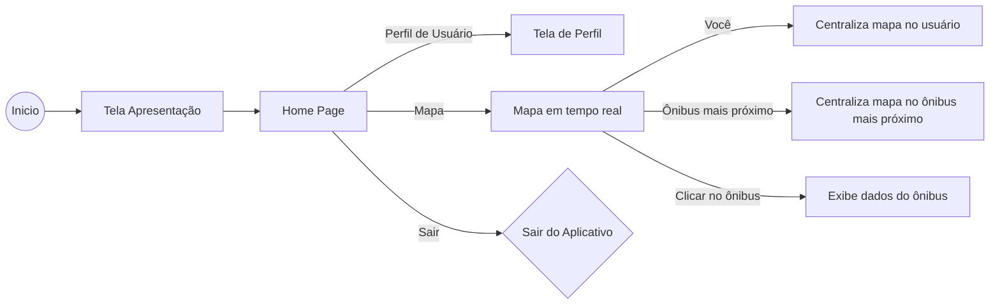

# MOVUS APP
Aplicativo do Projeto PI Fatec 2023 - Movus

## Alunos
Otávio T. F. da Cunha  
Cleber Pereira dos Santos Junior  
Pedro Henrique Leite dos Santos  
Luan Vinicius Garcia  

### Requisitos:
<ol>
    <li>- [x] Criar uma aplicação Flutter​​​​</li>
    <li>- [x] Nome dos integrantes em algum arquivo do projeto no repositório​</li>
    <li>- [x] Uso de tanto StalessWidgets como StatefullWidget</li>
    <li>- [x] Organizar o projeto de acordo com as praticas mostradas em aula (pasta widgets, pages, models... conforme necessário) ​</li>
    <li>- [x] Utilizar algum pacote externo (aqueles lá do PubDev) ​</li>
</ol>

### Conclusões:
<ol>
    <li>- [x] Aplicativo desenvolvido usando open street maps​​​​</li>
    <li>- [x] Nome no Readme​</li>
    <li>- [x] Tem vários widgets compartilhados e menu, utilizamos tanto stateless quanto statefull</li>
    <li>- [x] As pastas estão organizadas com MVC​</li>
    <li>- [x] Utilizamos vários pacotes externos: back4app, flutter maps, shared_preferences, dio, fontawesome, flutter env, etc... ​</li>
</ol>

### Fluxograma:

