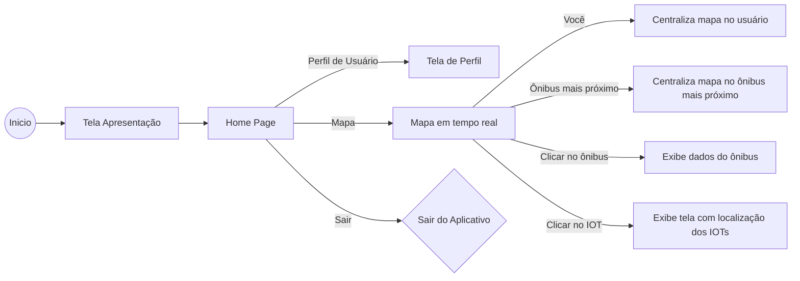

# MOVUS APP
Aplicativo do Projeto Final 2024 - Movus 
Laboratório de desenvolvimento multiplataforma

## Alunos
Cleber Pereira dos Santos Junior 
Luan Vinicius Garcia 
Otávio T. F. da Cunha  
Pedro Henrique Leite dos Santos 

### Requisitos:
<ol>
    <li>- [x] Desenvolver uma aplicação para dispositivos móveis, web e desktop​​​ (Flutter)​</li>
    <li>- [x] Utilizar sensores IOT (utilizamos GPS NEO 6m + raspberry pi 3)​</li>
    <li>- [x] MQTT e sistemas distribuídos (AWS Iot Core)</li>
    <li>- [x] Armazenamento de dados em grande escala (Back4App/MongoDB) ​</li>
    <li>- [x] Responsabilidade Social e Cidadania ​</li>
    <li>- [x] Ações de cultura, ciência e inovação ​</li>
    <li>- [x] Desenvolvimento dirigido a testes (TDD) ​</li>
    <li>- [x] Controle de versionamento (git) ​</li>
</ol>

### Fluxograma do Aplicativo:

